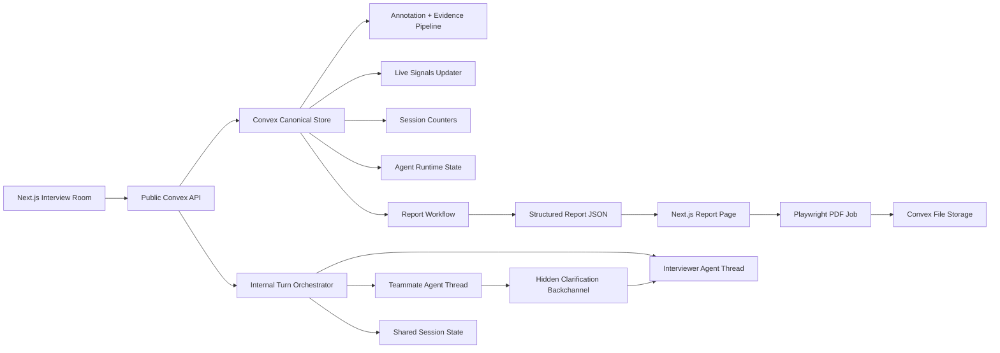
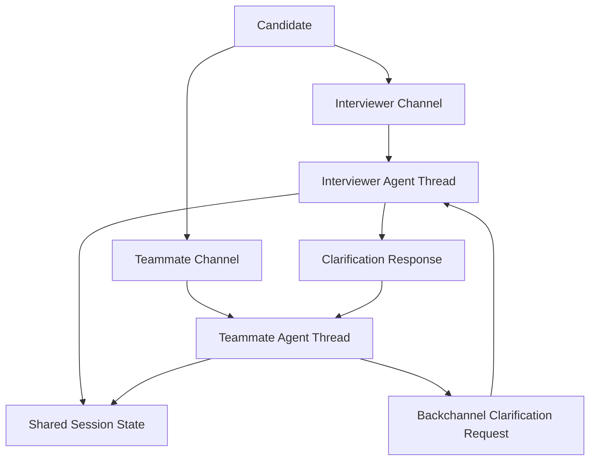

# Technical Architecture

## Overview

This architecture is intentionally **UI-first**. The system design in this document now matches the interaction model shown in [UI.md](/Users/avichaldwivedi/dev/Mythos/UI.md), not a generic chatbot architecture.

The product is a **real-time multi-agent interview room** with:

- two candidate-facing channels:
  - `Interviewer`
  - `Teammate`
- one shared session state across both channels
- a standardized phase-based interview flow
- live candidate-visible progress signals
- a private scratch pad
- hidden evaluation and scoring services
- a final evidence-backed report and PDF

The guiding principle is:

**LLMs handle dialogue, structured annotations, and report writing. Convex and application code handle state, orchestration, fairness, permissions, realtime sync, and durability.**

## UI-First Product Contract

The backend must support every major element in the UI:

- left-rail timer and phase progress
- visible room roster with agent specialization and current mode
- two separate conversation tabs
- unread badges between tabs
- inline event markers like `Nudge`, `Stress`, and `Concern raised`
- live signals popup
- private scratch pad
- manual end-session action
- final report generation and PDF delivery

If a feature is in the UI, the architecture should treat it as a real product requirement, not a styling suggestion.

## Recommended Stack

### Frontend

- **Next.js App Router**
  - interview room UI
  - live tabbed conversation experience
  - scratch pad UI
  - report viewer
  - PDF-ready report page

### Backend and Realtime State

- **Convex**
  - canonical source of truth
  - realtime subscriptions
  - session, message, note, event, and report storage
  - scheduling
  - file storage

### Convex Components

- **Agent component (`@convex-dev/agent`)**
  - interviewer and teammate thread state
  - persistent agent message history
  - async message generation
  - usage tracking
  - built-in thread context handling and search over history

- **Workflow component (`@convex-dev/workflow`)**
  - durable end-of-session report pipeline
  - observable multi-step report generation
  - retries and resumability

- **Rate Limiter component**
  - message send throttling
  - session-level token budget protection
  - anti-spam protection in demo mode

- **Workpool component**:
  - recommended if we expect multiple concurrent demo sessions
  - isolate long-running report/PDF work from latency-sensitive live interview turns

### Model Layer

- **Gemini API**
  - interviewer responses
  - teammate responses
  - structured annotations
  - live signal updates
  - final report JSON

### PDF Layer

- **Playwright running in Next.js server-side Node runtime**
  - render the report page as HTML
  - export deterministic PDF
  - upload final PDF artifact back to Convex

This PDF step should not run inside regular Convex mutations or queries. It is operationally cleaner in a Next.js route handler or background Node worker, while Convex remains the canonical data system.

## Explicit Hackathon Constraints

- no full auth
- no Neo4j
- no LangGraph
- no voice mode in MVP
- no recruiter multi-tenant dashboard in MVP

We will use:

- a generated `sessionPublicId`
- optionally a lightweight session secret or host token
- local candidate name entry

That gives us enough session isolation for a hackathon without taking on full identity management.

## Convex-Native Design Rules We Are Following

This architecture follows the Convex rules in [convex_rules.txt](/Users/avichaldwivedi/dev/Mythos/convex_rules.txt) and [convex/_generated/ai/guidelines.md](/Users/avichaldwivedi/dev/Mythos/convex/_generated/ai/guidelines.md):

- define schema in `convex/schema.ts`
- use file-based routing and clear public vs internal function boundaries
- use `query`, `mutation`, and `action` for public API
- use `internalQuery`, `internalMutation`, and `internalAction` for orchestration internals
- use validators for all Convex functions
- avoid unbounded arrays inside documents
- keep high-churn operational state in dedicated tables
- query through indexes instead of `filter`
- use pagination for long message lists
- keep Node-only logic in action files with `"use node";`

These rules directly shape the schema and function split below.

## System Architecture



## Core Runtime Objects

The app should be modeled around these domain objects.

### 1. Session

Represents one interview room.

Holds:

- scenario identity and version
- rubric version
- session mode
- status
- time budget
- current phase
- currently active channel if needed for resume
- final report status

### 2. Channel

Each session has two visible channels:

- `interviewer`
- `teammate`

Each channel has:

- a title
- an agent role
- a dedicated Agent component thread id
- a display badge and specialization label

The UI tabs map directly to channel records.

### 3. Shared Session State

This is the cross-channel memory layer that keeps the system coherent.

It contains the latest structured understanding of:

- extracted requirements
- approved clarifications
- assumptions the candidate made
- current architecture decisions
- unresolved risks
- open questions
- contradictions detected
- latest phase summary

Important:

This is **not** stored as one giant unbounded array on the session document.  
We will use a combination of:

- `sessionState` for current condensed state
- `sessionFacts` for append-only extracted facts and decisions
- `phaseSummaries` for rollups

### 4. Agent Runtime State

This drives the UI presence pulses and mode labels.

For each visible agent we track:

- `status`: `idle | thinking | streaming | waiting | blocked`
- `mode`: `probe | nudge | challenge | stress | clarify_with_interviewer | collaborate`
- `lastHeartbeatAt`
- `lastVisibleMessageId`
- `currentPhase`

This belongs in a dedicated high-churn table, not on `sessions`.

### 5. Live Signals

These are the candidate-facing signals shown in the left rail popup.

They are not the final hiring scores. They are a **safe projection** of current progress:

- requirements coverage
- architecture coverage
- tradeoff coverage
- collaboration quality
- nudges given

The final report can use richer and stricter scoring. The live UI should show smoothed and candidate-safe progress indicators.

### 6. Scratch Notes

The scratch pad is a first-class feature.

Notes are:

- private to the candidate
- persisted in Convex
- not visible to the interviewer or teammate
- not used in evaluation unless the user explicitly submits them as part of an answer

This matters both for UX and fairness.

### 7. Evidence and Reports

Hidden evaluation services produce:

- annotations tied to exact messages and spans
- metric snapshots
- final structured report JSON
- final PDF artifact

## Channel Topology

The UI shows two channels, so the runtime must support two separate but synchronized conversations.



### Why We Need This Split

The UI is not a single merged chat. It is two parallel tabs:

- one formal interview lane
- one specialist discussion lane

That means the architecture must support:

- separate per-channel message history
- separate typing status
- separate unread state
- separate agent mode labels
- cross-channel state sync

### Cross-Channel Consistency Strategy

We should **not** copy the entire content of one channel into the other after every message. That wastes tokens and creates noisy prompts.

Instead:

- each visible channel has its own thread
- both agents read from the same structured `sessionState`
- after each meaningful turn, the orchestrator updates:
  - extracted facts
  - current design summary
  - unresolved issues
  - last important teammate concern
  - last important interviewer challenge

This gives both agents the same canonical understanding without forcing them to ingest the full transcript from the other channel every time.

## Convex Components We Will Use

### 1. Agent Component

Use the Agent component for:

- creating one thread for the interviewer channel
- creating one thread for the teammate channel
- generating interviewer and teammate responses
- maintaining message history for each channel
- tracking token usage with `usageHandler`

We should keep our own product-level `messages` table as the canonical UI and reporting record, while the Agent component threads serve as the LLM conversation memory and generation substrate.

That gives us:

- clean product queries
- explicit channel metadata
- easier evidence extraction
- freedom to decorate messages with UI badges

### 2. Workflow Component

Use the Workflow component for the **end-of-session report flow**, because this is:

- multi-step
- retryable
- potentially long-running
- observable in real time

The workflow should own:

- transcript freeze
- final evidence aggregation
- report JSON generation
- PDF job handoff
- report status updates

### 3. Rate Limiter

Use a rate limiter for:

- message send frequency per session and channel
- abuse control in demo environments
- token usage throttling via agent `usageHandler`

Because we are skipping auth, the limiter should key primarily on:

- `sessionPublicId`
- optionally `sessionSecret`
- possibly IP as a secondary guard in Next.js

### 4. Workpool

Use Workpool if we want to protect live interview responsiveness under load.

Suggested priority split:

- high priority:
  - candidate sends message
  - turn orchestration
  - interviewer / teammate response generation
- lower priority:
  - heavy annotation backfills
  - final PDF generation
  - transcript appendix generation

For a single-session hackathon demo this is optional. For multiple concurrent sessions it is strongly recommended.

## Data Model

All long-lived state lives in Convex. The schema should favor:

- small focused documents
- append-only event rows
- high-churn state in separate tables
- query patterns driven by indexes

## Core Tables

### `sessions`

Purpose:

- room-level metadata

Fields:

- `publicId`
- `mode`: `assessment | practice | coaching`
- `status`: `active | ending | generating_report | completed | failed`
- `scenarioId`
- `scenarioVersion`
- `rubricVersion`
- `currentPhase`
- `timeBudgetMs`
- `startedAt`
- `endedAt`
- `finalReportId`
- `interviewerChannelId`
- `teammateChannelId`

Recommended indexes:

- `by_publicId`
- `by_status_and_startedAt`

### `channels`

Purpose:

- represent the two visible tabs

Fields:

- `sessionId`
- `kind`: `interviewer | teammate`
- `title`
- `agentRole`
- `specialization`
- `threadId`
- `sortOrder`

Recommended indexes:

- `by_sessionId_and_sortOrder`
- `by_sessionId_and_kind`

### `messages`

Purpose:

- canonical product transcript

Fields:

- `sessionId`
- `channelId`
- `threadId`
- `sequence`
- `speakerType`: `candidate | interviewer | teammate | system`
- `speakerLabel`
- `content`
- `phase`
- `badgeKind`: `brief | nudge | stress | concern | clarification | team`
- `eventSummary`
- `createdAt`
- `replyToMessageId`
- `visibleToCandidate`

Recommended indexes:

- `by_sessionId_and_sequence`
- `by_channelId_and_sequence`
- `by_sessionId_and_createdAt`

Use pagination for long channel histories.

### `events`

Purpose:

- machine-readable timeline of all meaningful actions

Fields:

- `sessionId`
- `channelId`
- `messageId`
- `type`
- `actor`
- `target`
- `metadata`
- `createdAt`

Recommended indexes:

- `by_sessionId_and_createdAt`
- `by_sessionId_and_type_and_createdAt`
- `by_channelId_and_createdAt`

### `annotations`

Purpose:

- exact evidence extraction

Fields:

- `sessionId`
- `messageId`
- `turnSequence`
- `label`
- `impact`
- `confidence`
- `excerpt`
- `spanStart`
- `spanEnd`
- `rationale`
- `evidenceGroup`

Recommended indexes:

- `by_sessionId_and_turnSequence`
- `by_messageId`
- `by_sessionId_and_label`

### `sessionFacts`

Purpose:

- append-only structured knowledge extracted from the interview

Kinds:

- `requirement`
- `clarification`
- `assumption`
- `decision`
- `risk`
- `open_question`
- `contradiction`

Fields:

- `sessionId`
- `kind`
- `content`
- `sourceMessageId`
- `confidence`
- `resolved`
- `createdAt`

Recommended indexes:

- `by_sessionId_and_kind_and_createdAt`
- `by_sessionId_and_resolved`

### `sessionState`

Purpose:

- latest condensed snapshot for agent prompting

Fields:

- `sessionId`
- `currentArchitectureSummary`
- `currentRequirementSummary`
- `latestRiskSummary`
- `latestInterviewerChallenge`
- `latestTeammateConcern`
- `latestCrossChannelDigest`
- `updatedAt`

Recommended indexes:

- `by_sessionId`

### `phaseSummaries`

Purpose:

- per-phase condensed rollups

Fields:

- `sessionId`
- `phase`
- `summary`
- `startedAt`
- `endedAt`

Recommended indexes:

- `by_sessionId_and_phase`

### `agentRuntimeState`

Purpose:

- high-churn UI status

Fields:

- `sessionId`
- `channelId`
- `agentRole`
- `status`
- `mode`
- `phase`
- `lastHeartbeatAt`
- `lastVisibleMessageId`

Recommended indexes:

- `by_sessionId_and_agentRole`
- `by_channelId`

### `signalState`

Purpose:

- latest candidate-visible live signals

Fields:

- `sessionId`
- `requirementsScore`
- `architectureScore`
- `tradeoffScore`
- `collaborationScore`
- `nudgesGiven`
- `updatedAt`

Recommended indexes:

- `by_sessionId`

### `metricSnapshots`

Purpose:

- full scoring history and report inputs

Fields:

- `sessionId`
- `metricName`
- `value`
- `evidenceIds`
- `snapshotType`: `live | final`
- `createdAt`

Recommended indexes:

- `by_sessionId_and_metricName_and_createdAt`

### `sessionCounters`

Purpose:

- denormalized counts for fast UI and reporting

Fields:

- `sessionId`
- `candidateMessageCount`
- `interviewerMessageCount`
- `teammateMessageCount`
- `nudgeCount`
- `stressCount`
- `clarificationCount`
- `teammateConcernCount`
- `revisionCount`
- `hintFishingCount`
- `totalTokens`
- `totalInputTokens`
- `totalOutputTokens`

Recommended indexes:

- `by_sessionId`

This avoids expensive counting queries over growing tables.

### `scratchNotes`

Purpose:

- persistent candidate notes

Fields:

- `sessionId`
- `label`
- `color`
- `content`
- `sortOrder`
- `archived`
- `createdAt`
- `updatedAt`

Recommended indexes:

- `by_sessionId_and_sortOrder`

### `reports`

Purpose:

- structured final report

Fields:

- `sessionId`
- `status`: `queued | analyzing | scoring | rendering_pdf | ready | failed`
- `reportJson`
- `finalRecommendation`
- `pdfStorageId`
- `errorMessage`
- `createdAt`
- `updatedAt`

Recommended indexes:

- `by_sessionId`
- `by_status_and_createdAt`

### `reportArtifacts`

Purpose:

- optional additional artifacts

Fields:

- `reportId`
- `kind`: `pdf | transcript_appendix | raw_json`
- `storageId`
- `createdAt`

Recommended indexes:

- `by_reportId_and_kind`

## Public vs Internal Function Design

Following Convex best practices, we should keep the UI-facing API thin and safe, and move orchestration into internal functions.

## Public Functions

These are called directly by the Next.js app.

### `convex/sessions.ts`

- `createSession`
- `getRoom`
- `endSession`
- `getSessionStatus`

### `convex/channels.ts`

- `listChannelMessages`
- `sendCandidateMessage`
- `getChannelMeta`

### `convex/notes.ts`

- `listNotes`
- `createNote`
- `updateNote`
- `deleteNote`

### `convex/signals.ts`

- `getLiveSignals`

### `convex/reports.ts`

- `getReport`
- `getReportStatus`
- `getReportDownloadUrl`

## Internal Functions

These should be private orchestration endpoints.

### `convex/orchestrator.ts`

- `handleCandidateTurn`
- `decideNextAction`
- `emitVisibleResponse`
- `advancePhaseIfNeeded`

### `convex/agents/interviewer.ts`

- Node action for interviewer generation

### `convex/agents/teammate.ts`

- Node action for teammate generation

### `convex/evaluation.ts`

- `annotateVisibleTurn`
- `updateSignalState`
- `updateMetricSnapshots`
- `updateSessionState`

### `convex/reportWorkflow.ts`

- workflow definition and launch entrypoint

### `convex/files.ts` or `convex/http.ts`

- artifact ingest or status update from the PDF renderer if needed

## UI State Mapping

This section explicitly ties the UI to backend state.

### Left Rail Timer

Derived from:

- `sessions.startedAt`
- `sessions.timeBudgetMs`

The client should render the ticking countdown locally. We should not write to Convex every second just for the timer.

### Left Rail Phase Tracker

Derived from:

- `sessions.currentPhase`
- `phaseSummaries`
- scenario phase order

### Agent Cards

Derived from:

- `channels`
- `agentRuntimeState`

UI fields:

- name
- specialization
- current mode
- pulse / presence

### Live Signals Popup

Derived from:

- `signalState`
- `sessionCounters`

Important:

These are candidate-facing live signals, not the final hiring rubric.

### Tabs

Derived from:

- `channels`

### Unread Badges

This can be client-derived in MVP.

Track locally:

- last viewed `sequence` per channel
- latest known `sequence` per channel

If we later need cross-device continuity, we can persist this in a `channelViewState` table.

### Message Badges and Event Chips

Derived from:

- `messages.badgeKind`
- `messages.eventSummary`
- related `events`

Examples:

- `Brief`
- `Nudge`
- `Stress`
- `Concern raised`
- `Clarification`

### Typing Indicator / Thinking Bubbles

Derived from:

- `agentRuntimeState.status`

When the orchestrator dispatches a generation action:

- set agent status to `thinking`
- when the response is persisted, set status to `idle`

### Scratch Pad

Derived from:

- `scratchNotes`

These notes should autosave through mutations and subscribe live in the UI.

## Session Lifecycle

## 1. Session Creation

When the user starts a session:

1. create a `sessions` row
2. create two `channels`
3. create one Agent thread for each channel
4. seed initial `agentRuntimeState`
5. seed initial `signalState`
6. create initial interviewer brief message
7. initialize `sessionCounters`

## 2. Candidate Sends a Message

This is the main live path.

### Flow

1. candidate sends a message in a channel
2. public mutation validates:
   - session is active
   - message length is within policy
   - rate limiter allows the send
3. mutation inserts:
   - `messages`
   - `events`
   - counter increments
4. mutation schedules internal orchestration
5. orchestrator marks the target agent as `thinking`
6. orchestrator loads:
   - current channel thread
   - current `sessionState`
   - unresolved facts
   - current phase
   - mode policy
7. orchestrator decides the next action
8. the relevant agent generates a response
9. response is written to:
   - Agent thread
   - `messages`
   - `events`
10. hidden evaluation runs
11. `signalState`, `sessionState`, and `agentRuntimeState` are updated

## 3. Phase Advancement

Phase advancement should be explicit and policy-controlled, not purely time-based.

Advance a phase when:

- the minimum expected content for the phase is covered
- or the interviewer intentionally moves the candidate forward
- or time pressure requires progress

The router updates:

- `sessions.currentPhase`
- `phaseSummaries`
- `agentRuntimeState.phase`

## Agentic Turn Routing

The system needs a deterministic router because the UI shows structured, meaningful behavior.

Possible next actions:

- interviewer `probe`
- interviewer `nudge`
- interviewer `challenge`
- interviewer `stress`
- teammate `collaborate`
- teammate `challenge`
- teammate `clarify_with_interviewer`
- phase `advance`

### Routing Inputs

- latest candidate message
- active channel
- current phase
- `sessionState`
- unresolved risks
- prior nudges and stress count
- specialization relevance
- mode policy

## Interviewer Agent Contract

The interviewer is the formal interviewer.

Allowed:

- ask clarifying questions
- reveal only approved clarifications
- redirect the candidate if they drift
- challenge unsupported decisions
- inject stress in a standardized way
- move phases forward

Not allowed:

- solve the problem directly
- leak hidden rubric logic
- reveal hidden scenario facts early
- say whether the candidate is currently passing or failing

### Interviewer Modes

- `brief`
- `probe`
- `nudge`
- `challenge`
- `stress`
- `close`

## Teammate Agent Contract

The teammate is a specialist collaborator, not a copilot that solves the interview.

Allowed:

- discuss the proposed architecture
- raise specialization-specific concerns
- push on weak assumptions
- suggest bounded alternatives
- ask the interviewer for clarification if needed

Not allowed:

- give away the final answer
- expose hidden requirements
- privately grade the candidate
- replace the interviewer as the primary evaluator

### Teammate Modes

- `collaborate`
- `challenge`
- `clarify_with_interviewer`
- `observe`

## Nudge Architecture

Nudges are now a first-class system behavior because the UI expects them.

### When To Nudge

- the candidate jumps into components before gathering enough requirements
- a core design choice is made without assumptions
- the candidate leaves a major hole unresolved
- the candidate misses an earlier requirement
- the candidate ignores a teammate concern that matters

### What A Nudge Should Do

- move the candidate back toward a better reasoning path
- stay directional, not solution-revealing
- be visible in the UI as a `Nudge`
- increment the nudge counter
- be captured in the final report

## Stress Architecture

Stress is separate from nudging.

### When To Stress

- after a major architectural commitment
- when the candidate gives vague justification
- when a contradiction appears
- at specific scenario checkpoints
- when time is running out

### What Stress Looks Like

- scale jump
- failure injection
- consistency challenge
- prioritization under time pressure
- detailed “why this choice?” challenge

Stress messages must:

- be standardized
- be explainable in the report
- be tagged in the UI and event log

## Teammate-to-Interviewer Clarification Path

This is a required feature because the UI and product behavior assume the teammate can coordinate with the interviewer.

### Flow

1. teammate detects ambiguity in scope
2. teammate enters `clarify_with_interviewer` mode
3. orchestrator creates a hidden clarification request event
4. interviewer policy decides whether the clarification is allowed
5. the allowed clarification is returned
6. the teammate channel receives a candidate-visible message such as:
   - “I checked with the interviewer: multi-region is not required for v1.”
7. events are recorded:
   - `teammate_to_interviewer_query`
   - `interviewer_clarification_to_teammate`

Important:

This happens through controlled hidden orchestration, not through a third user-visible tab.

## Event Model

We should record all important actions as structured events.

Required event types:

- `session_started`
- `phase_started`
- `message_sent`
- `clarification_requested`
- `clarification_revealed`
- `candidate_drift_detected`
- `interviewer_nudge_issued`
- `nudge_accepted`
- `nudge_ignored`
- `challenge_injected`
- `stress_event_started`
- `stress_event_resolved`
- `teammate_concern_raised`
- `teammate_to_interviewer_query`
- `interviewer_clarification_to_teammate`
- `design_revised`
- `contradiction_detected`
- `phase_completed`
- `report_generation_started`
- `report_generated`

## Live Signals Model

The UI includes live signals, so the architecture must define them clearly.

### Candidate-Facing Signals

- `Requirements`
- `Architecture`
- `Tradeoffs`
- `Collaboration`
- `Nudges given`

### Important Rule

These are **not** direct recruiter scores.

They should be:

- smoothed
- coarse
- easy to understand
- safe to expose during the interview

### Computation Strategy

After each visible turn:

1. annotation service tags the turn
2. signal updater combines:
   - relevant new annotations
   - session counters
   - phase progress
3. `signalState` is updated

Example interpretation:

- `Requirements`: how much of the discovery space has been covered
- `Architecture`: how coherent the current high-level design is
- `Tradeoffs`: whether tradeoffs are being articulated
- `Collaboration`: how productively the candidate is engaging the teammate
- `Nudges given`: direct count from `sessionCounters`

## Hidden Evaluation Pipeline

This is separate from the live UX.

After each meaningful visible turn:

1. `annotateVisibleTurn`
   - create evidence spans
   - extract facts
2. `updateSessionState`
   - refresh cross-channel summary
3. `updateMetricSnapshots`
   - update hidden evaluation metrics
4. `updateSignalState`
   - refresh candidate-visible progress signals

## Exact Moment Flagging

The report must be citation-based.

Every highlighted moment should be traceable to:

- message id
- turn sequence
- channel
- speaker
- excerpt
- annotation label
- impact

Examples:

- interviewer nudged the candidate to address ordering before finalizing storage
- teammate raised a routing concern that improved the design
- interviewer applied a scale-stress scenario and the candidate partially recovered
- candidate repeatedly sought directional help before making progress

## Scoring Model

The hidden scoring layer should combine deterministic and semantic signals.

### Deterministic Inputs

- clarifications requested
- nudges given
- nudge recovery rate
- stress events
- contradictions
- revisions
- teammate concern count
- hint-fishing attempts
- token usage and turn counts

### LLM-Evaluated Inputs

- requirement quality
- architecture coherence
- tradeoff depth
- correctness confidence
- communication clarity
- collaboration quality
- stress response quality

### Final Metrics

- requirement discovery
- architectural quality
- scalability reasoning
- tradeoff depth
- communication clarity
- collaboration quality
- stress handling
- consistency
- interviewer assistance dependency
- teammate interaction quality
- overall recommendation

## Final Report Workflow

The final report should be generated by a durable workflow.

## Trigger

- candidate presses `End Session`
- or timer expires
- or the interviewer closes the final phase

## Workflow Steps

### Step 1: Freeze Session

- mark session as `ending`
- stop visible messaging
- finalize current phase
- finalize `sessionState`

### Step 2: Aggregate Evidence

- gather messages from both channels
- gather events
- gather annotations
- gather counters
- gather live metric snapshots

### Step 3: Final Scoring

- compute final hidden metrics
- select strongest strengths and concerns
- build evidence references

### Step 4: Generate Structured Report JSON

Gemini generates a validated JSON object containing:

- session summary
- score breakdown
- interviewer guidance analysis
- teammate interaction analysis
- stress handling analysis
- notable flagged moments
- strengths
- concerns
- recommendation

Every major conclusion must include supporting evidence ids.

### Step 5: Render HTML Report

Next.js renders a report route from the report JSON.

Suggested route:

- `/reports/[sessionPublicId]`

### Step 6: Generate PDF

A server-side Node process or route handler uses Playwright to:

- open the report route
- wait for report data and charts to render
- print the page to PDF

### Step 7: Persist Artifacts

Store in Convex:

- final report JSON
- PDF storage id
- optional transcript appendix

### Step 8: Mark Ready

- `reports.status = ready`
- `sessions.status = completed`

## PDF Architecture

The final PDF should be an output artifact, not the primary report source.

### Source of Truth

- `reports.reportJson`

### Rendering Layer

- Next.js report page

### Export Layer

- Playwright PDF job

### Storage Layer

- Convex File Storage

This separation makes retries easier:

- if JSON generation fails, rerun scoring/generation
- if PDF rendering fails, rerun only the export step

## PDF Structure

### Page 1

- session summary
- scenario name
- final recommendation
- headline metrics

### Page 2

- full score breakdown
- metric explanations

### Page 3

- flagged moments timeline
- positive and negative turning points

### Page 4

- interviewer guidance analysis
- nudges given
- recovery after nudges
- assistance dependency

### Page 5

- teammate interaction analysis
- specialization challenges raised
- whether teammate feedback improved the design
- teammate-to-interviewer clarification moments

### Page 6

- stress handling analysis
- contradiction handling
- design defense quality

### Appendix

- selected transcript excerpts with channel and turn references

## What Is Visible To The Candidate vs Hidden

### Candidate Visible

- both conversation channels
- phase tracker
- timer
- agent mode and specialization labels
- live signals
- scratch pad
- inline nudge / stress / concern markers
- report readiness state
- final report and PDF

### Hidden

- raw rubric logic
- exact model prompts
- detailed evaluator chain-of-thought
- internal routing reasons
- hidden clarification policy
- high-granularity scoring internals

This keeps the UX transparent enough to be useful without leaking the grading engine.

## Suggested Convex File Layout

```text
convex/
  convex.config.ts
  schema.ts
  sessions.ts
  channels.ts
  notes.ts
  signals.ts
  reports.ts
  http.ts
  orchestrator.ts
  evaluation.ts
  files.ts
  reportWorkflow.ts
  agents/
    interviewer.ts
    teammate.ts
```

## Recommended Implementation Order

### Phase 1

- schema
- sessions
- channels
- messages
- notes
- live room UI with mocked agents

### Phase 2

- Agent component integration
- interviewer and teammate generation
- agent runtime state
- dual-channel sync

### Phase 3

- annotations
- signal updates
- nudge and stress tagging

### Phase 4

- end-session workflow
- report JSON
- report page
- PDF export

### Phase 5

- rate limiting
- workpool separation if needed
- polishing and validation

## Why This Architecture Matches The UI Better

Compared to the earlier architecture, this version now explicitly supports:

- two separate visible tabs and channel semantics
- agent mode labels and presence pulses
- live candidate-facing signals
- inline event decorations
- persistent scratch notes
- teammate-to-interviewer clarification flow
- report generation states after end-session

That means the technical design now matches the actual product experience instead of only the underlying evaluation logic.

## References

- [Convex Components](https://docs.convex.dev/components/using)
- [Convex Agent Component](https://docs.convex.dev/agents/getting-started)
- [Convex Agent Usage](https://docs.convex.dev/agents/agent-usage)
- [Convex Agent Threads](https://docs.convex.dev/agents/threads)
- [Convex Agent Streaming](https://docs.convex.dev/agents/streaming)
- [Convex Agent Usage Tracking](https://docs.convex.dev/agents/usage-tracking)
- [Convex Scheduling](https://docs.convex.dev/scheduling)
- [Workflow Component](https://www.npmjs.com/package/%40convex-dev/workflow)
- [Workpool Component](https://www.npmjs.com/package/%40convex-dev/workpool)
- [Convex React](https://docs.convex.dev/client/react)
